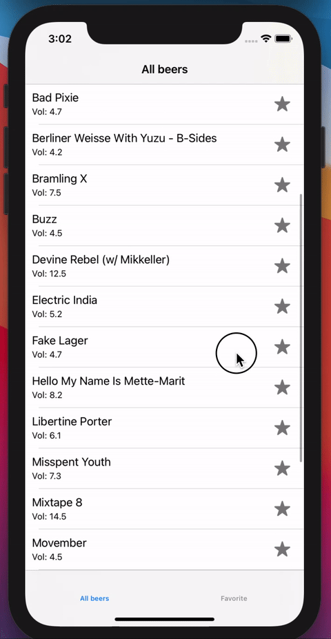

#  App with MVVM and Unit Tests

## What I created

I made an application that, using JSON, MVVM architecture, Core Data, Unit Tests, and build app without StoryBoard 

## What I Used

* JSON file.
* Use the MVVM architecture. 
* Core Data
* Unit tests
* Build without StoryBoard

